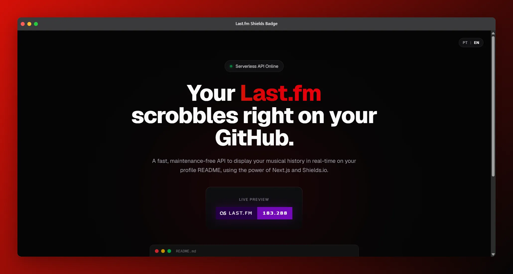

# 🎵 Last.fm GitHub Badge Generator



<div align="center">

## Live Preview

<p>
  <a href="https://www.last.fm/user/strattegia" target="_blank"></a>
</p>

</div>

<p>
  Uma API Serverless ultrarrápida desenvolvida com <strong>Next.js</strong> que busca o seu total de scrobbles do <strong>Last.fm</strong><br />
  e gera um <strong>badge dinâmico via Shields.io</strong> para você exibir no README do seu perfil do GitHub.
</p>

<p>
  O projeto conta também com uma <strong>Landing Page minimalista e moderna</strong>, focada em UI/UX e Dark Mode,
  apresentando o serviço de forma elegante.
</p>

### Stack Utilizada

<div align="center">
  <a href="https://nextjs.org/"></a>
  <a href="https://www.typescriptlang.org/"></a>
  <a href="https://tailwindcss.com/"></a>
  <a href="https://shields.io/"></a>
  <a href="https://www.last.fm/api"></a>
  <a href="https://vercel.com/"></a>
  <a href="https://analytics.google.com/"></a>
</div>

***

## ✨ Features

- **⚡ Serverless & Edge Ready:** Respostas em milissegundos utilizando Next.js App Router e Vercel.
- **🎨 UI/UX Premium:** Landing page com efeitos *glassmorphism*, glow neón e design responsivo.
- **🌐 Internacionalização (i18n):** Troca dinâmica de idioma (PT/EN) diretamente no frontend.
- **🛡️ Cache Inteligente:** Configuração de headers para evitar que o GitHub (Camo) congele o cache da imagem, garantindo scrobbles em tempo real.
- **📊 Analytics Integrado:** Suporte nativo ao Google Analytics e Vercel Analytics para monitoramento de tráfego.

***

## 🚀 Como Usar no seu GitHub

Você **não precisa rodar o projeto localmente** para usar o badge. Basta copiar o código Markdown abaixo, colar no seu `README.md` do GitHub e trocar a URL para a da sua API:

### Exemplo de uso

```md
<a href="https://www.last.fm/user/seu-perfil" target="_blank"></a>
```

***

## 💻 Instalação Local (Self-Hosting)

Se você deseja clonar o projeto para rodar sua própria instância, siga os passos abaixo:

### 1. Clone o repositório

```bash
git clone https://github.com/strattegia-mp3/lastfm-shields-badge.git
cd lastfm-shields-badge
```

### 2. Instale as dependências

```bash
npm install
```

### 3. Configure as variáveis de ambiente

Crie um arquivo `.env.local` na raiz do projeto e adicione suas credenciais do Last.fm (obtenha a API Key em `last.fm/api`):

```env
LASTFM_API_KEY=sua_api_key_aqui
LASTFM_USER=seu_usuario_do_lastfm
NEXT_PUBLIC_BASE_URL=http://localhost:3000
```

### 4. Rode o servidor de desenvolvimento

```bash
npm run dev
```

Acesse `http://localhost:3000` no seu navegador para ver a página.

***

## 🛠️ Tecnologias Utilizadas

| Categoria | Tecnologia |
|---|---|
| **Framework** | [Next.js](https://nextjs.org/) (App Router) |
| **Linguagem** | [TypeScript](https://www.typescriptlang.org/) |
| **Estilização** | [Tailwind CSS v4](https://tailwindcss.com/) |
| **Geração de Badge** | [Shields.io](https://shields.io/) |
| **API de Dados** | [Last.fm API](https://www.last.fm/api) |
| **Hospedagem** | [Vercel](https://vercel.com/) |

***

## 📜 Licença e Direitos Autorais

Este projeto está protegido por uma **licença restrita de uso não-comercial**. O código é aberto para visualização e aprendizado, mas é estritamente proibida a cópia, distribuição, modificação para fins lucrativos ou a venda deste software.

Para mais detalhes, leia o arquivo [`LICENSE`](./LICENSE) no repositório.

***

<div align="right">
  <p><code>~ $ "Desenvolvido com 💜 e TypeScript por Victor Rocha."</code></p>
</div>